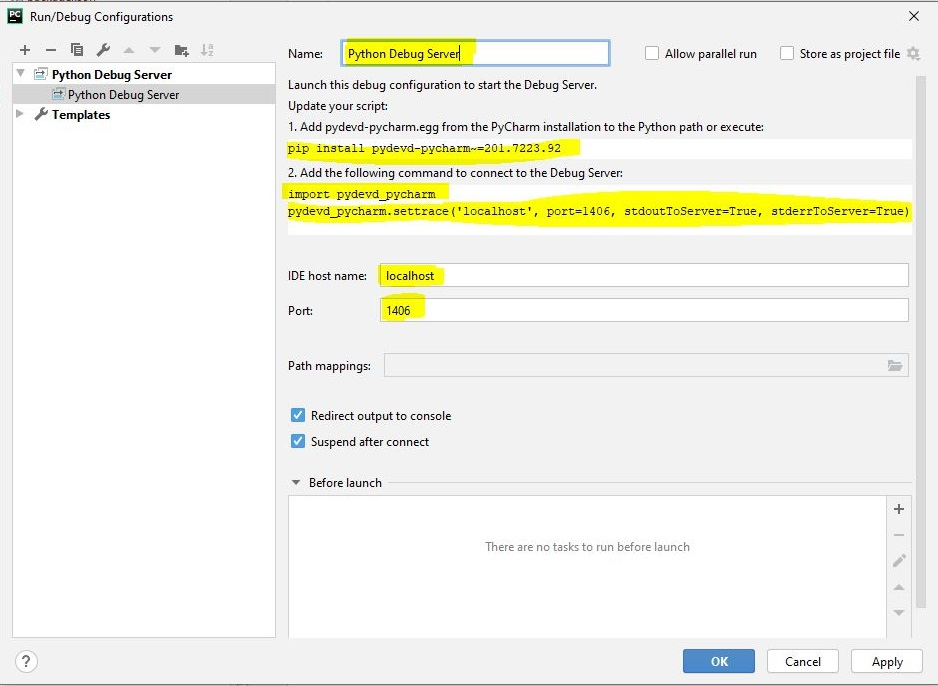
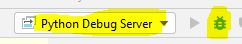

### Dependencies

**NodeJS**

Install the NodeJS: https://nodejs.org/en/download


##### Docker

Install the Docker: https://docs.docker.com/get-started/


##### Serverless  

Install Serverless  with global scope by command:

> npm i -g serverless


##### Python Environment

***You must ensure everything related to Python must be running on the same Python Environment***

Check the Python environment activated (based on the path of the Python):

> pip --version


##### Simulation

You can deploy the Kinesis and SQS locally by command:

> docker-compose up -d


##### Generate the mock data

> python mock-generator.py

### Setup the Serverless to Debug the Lambda on local environment

You can debug the Lambda on your local environment by setup a **Python Debug Server** and force the **Serverless Offline** to invoke the script connect to Python Debug Server.


**Step 1**: Click **Add Configuration..** button on the menu-bar

**Step 2**: Click the **Add New Configuration** button (the "**+**" icon)

**Step 3**: Select the **Python Debug Server**

**Step 4**:

-Setup the name of the configuration (Optional)

Sample:




-Run the command inside the input-box (***pip install pydevd-pycharm~=xxx.xxxx.xx***) to the install the **pydevd-pycharm** package.

Example:

> pip install pydevd-pycharm~=201.7223.92


**Step 5**:

Open invoke.py file to add a python script to connect to the Python debug server:

**MacOS**:

> /usr/local/lib/node_modules/serverless/lib/plugins/aws/invokeLocal/invoke.py

**Windows**

> %AppData%\npm\node_modules\serverless\lib\plugins\aws\invokeLocal\invoke.py


You can add the script at the top file to force the Serverless Offline to connect to the Python Debug Server:

```python
import pydevd_pycharm

pydevd_pycharm.settrace('localhost', port=1406, stdoutToServer=True, stderrToServer=True)
```


***Note***: You can using the code below to prevent the Python environment without **pydevd_pycharm** package

```python
try:
    DEBUG_SERVER_HOST = 'localhost'
    DEBUG_SERVER_PORT = 1406

    import pydevd_pycharm
    pydevd_pycharm.settrace(DEBUG_SERVER_HOST, port=DEBUG_SERVER_PORT, stdoutToServer=True, stderrToServer=True)
except Exception:
    pass
```

 

**Step 6**: Run the Python Debug Server as Debug mode



**Step 7**: Run the Serverless Offline by command:

> serverless offline start --stage=dev


***Note***: The **stage** is a parameter, you can get the value inside the **serverless.yml** file by the directive:

> ${opt:stage}


### AWS CLI Common

#### Kinesis:

##### Put the records

> aws kinesis put-records --cli-input-json file://***<file-name>*** --endpoint http://localhost:4567

Example:

> aws kinesis put-records --cli-input-json file://mocking/kinesis/user_created.json --endpoint http://localhost:4567
>

#### SQS:

##### Create queue:

> aws sqs create-queue --queue-name ***<queue-name>***  --endpoint-url http://localhost:9324


##### Listing queue:

> aws sqs list-queues --endpoint-url http://localhost:9324


##### Put Messages

> aws sqs send-message-batch --cli-input-json file://***<file-name>***  --endpoint http://localhost:9324

Example:

> aws sqs send-message-batch --cli-input-json file://mocking/sqs/user_created.json  --endpoint http://localhost:9324

